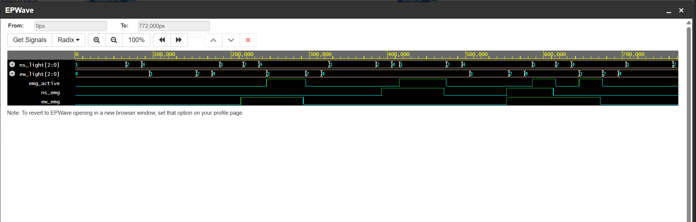

# Traffic Light Controller with Emergency Vehicle Override (Verilog)

A Moore FSM traffic light controller for a 4-way (North-South / East-West)
intersection with **emergency vehicle preemption**. Sensors (`ns_emg`, `ew_emg`)
can interrupt the normal cycle at any point, but the FSM always passes through
YELLOW + ALL-RED clearance before granting the emergency green — never an
abrupt switch. Once granted, the emergency green is held until the sensor
clears. If both roads request at once, NS is served first and EW stays pending.

## I/O

| Signal       | Dir | Width | Description                                 |
|--------------|-----|-------|----------------------------------------------|
| `clk`        | in  | 1     | System clock                                |
| `rst_n`      | in  | 1     | Active-low async reset                      |
| `ns_emg`     | in  | 1     | Emergency sensor, North-South road          |
| `ew_emg`     | in  | 1     | Emergency sensor, East-West road             |
| `ns_light`   | out | 3     | One-hot: `100`=Red `010`=Yellow `001`=Green |
| `ew_light`   | out | 3     | One-hot: `100`=Red `010`=Yellow `001`=Green |
| `emg_active` | out | 1     | High during an emergency phase              |

## States

`NS_GREEN → NS_YELLOW → ALLRED_A → EW_GREEN → EW_YELLOW → ALLRED_B → (repeat)`,
with `EMG_NS` / `EMG_EW` branching in from any state when a sensor fires, and
releasing back into the matching YELLOW state when it clears.

## Files

- `tlc_emergency.v` — RTL (parameterised GREEN_TIME / YELLOW_TIME / ALLRED_TIME)
- `tlc_emergency_tb.v` — testbench: normal cycling, single emergency on each
  road, simultaneous-request priority check
- `waveform.png` — EPWave screenshot from EDA Playground

## Waveform

Shows normal cycling, EW emergency preemption (light holds green while
`ew_emg` is high), NS emergency preemption, and NS-priority arbitration
when both sensors fire together.

## Run on EDA Playground

Set simulator to **Icarus Verilog**, paste `tlc_emergency.v` as Design and
`tlc_emergency_tb.v` as Testbench, tick "Open EPWave after run".

## Possible extensions

Full 4-leg intersection, pedestrian crossing phase, register-configurable
timing (APB/AXI-Lite).
